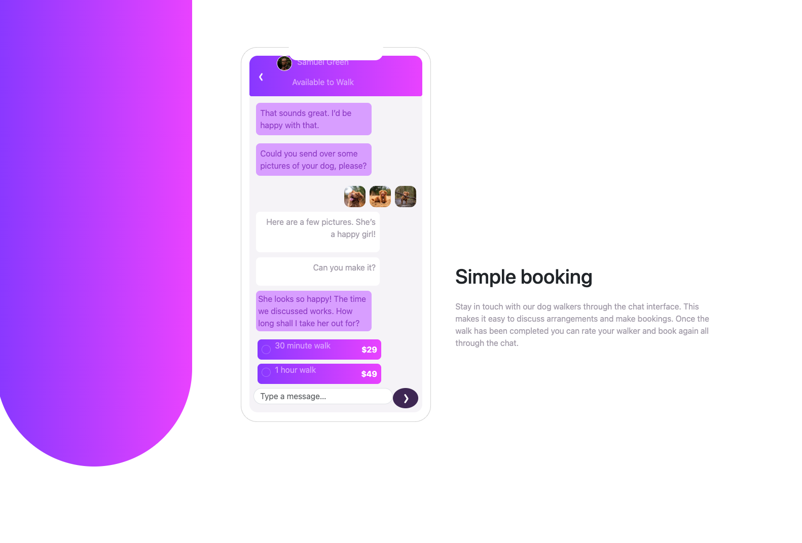

# Frontend Mentor - Chat app CSS illustration solution

This is a solution to the [Chat app CSS illustration challenge on Frontend Mentor](https://www.frontendmentor.io/challenges/chat-app-css-illustration-O5auMkFqY). Frontend Mentor challenges help you improve your coding skills by building realistic projects.

## Table of contents

- [Overview](#overview)
  - [The challenge](#the-challenge)
  - [Screenshot](#screenshot)
- [My process](#my-process)
  - [Built with](#built-with)
  - [What I learned](#what-i-learned)
  - [Useful resources](#useful-resources)
- [Acknowledgments](#acknowledgments)
- [Reflection](#reflection)

**Note: Delete this note and update the table of contents based on what sections you keep.**

## Overview

This project allows for me to implement bootstraps to replicate the Figma design for a dog walking application.

### Screenshot

Chat App

## My process

I started this process by adding the basic structures and containers for different sections of the page. As I continued to navigate building out the page. Once i had most of the main conatiners set I started including my assests and CSS designs.

### Built with

- Semantic HTML5 markup
- CSS custom properties
- Flexbox
- CSS Grid

### What I learned

I learned how to implement some of bootstraps classes more effectvely while getting the chance to write some custom CSS.
This process allowed me to reflect on the challenges of implementing a design.

### Useful resources

- [Bootstrap Docs](https://getbootstrap.com/docs/5.3/getting-started/introduction/) - This helped me determine what classes or utils to use
- [W3schools](https://www.w3schools.com) - This resource help me determine my css pproperties

**Note: Delete this note and replace the list above with resources that helped you during the challenge. These could come in handy for anyone viewing your solution or for yourself when you look back on this project in the future.**

## Refllection

- Write a brief reflection (100-200 words) discussing:
  - Challenges you encountered during the project.
  - Your approach to solving these challenges.
  - Improvements you would make if given more time.

This has been a challeneging project for me to align the correct Bootstrap and CSS properties so that my project reflects the figma design. To start solving this challenge I considered the containers that the data was presented in. As I started styling I realized my HTML structure needed to have more containers to ensure I could flex items and align them with other content. Given more time, I would review CSS and bootstraps deeper. I believe having better understanding of the best way to approach classes and utlities that bootstraps offer versus what the limitations of bootstrap could be would help me plan better.
